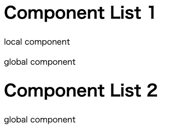

# ローカルコンポーネント

ローカルコンポーネントは、グローバルコンポーネントとは異なり、インスタンスの中で使用すると明記したとき、そのインスタンスの中でのみ使用することができます。以下の書き方をみてください。

```markup
<body>
  <div id="app">
    <h1>Component List</h1>
    <local-component />
  </div>
</body>

<script>
  var localComponent = {
    template: '<li>local component</li>'
  };
  var vm = new Vue({
    el: '#app',
    components: {
      'local-component': localComponent
    }
  });
</script>
```

local-componentとリスト表示されればOKです。今回はこのlocalComponentが主役になります。localComponentはまずはじめにoptionを記述しただけのJSON形式の変数となります。そして定義が終わったらVueインスタンスにcomponentsプロパティを追加し、そこに`タグ名:コンポーネント変数`をいれてやればローカルコンポーネントの定義は終わりです。これでlocal-componentタグが使用することができるようになりました。

これはグローバルコンポーネントとは何が違うのか？と感じると思います。以下の例をみてください。これはグローバルコンポーネントとローカルコンポーネントの両方を定義したときの例で
す。

```markup
<body>
  <div id="app">
    <h1>Component List 1</h1>
    <local-component></local-component>
    <global-component></global-component>
  </div>
  
  <div id="app2">
    <h1>Component List 2</h1>
    <local-component></local-component>
    <global-component></global-component>
  </div>
</body>

<script>
  var localComponent = {
    template: '<p>local component</p>'
  };
  
  Vue.component('global-component', {
    template: '<p>global component</p>'
  });
  
  var vm = new Vue({
    el: '#app',
    components: {
        'local-component': localComponent
    }
  });
  var vm2 = new Vue({
    el: '#app2',
  });
</script>
```

インスタンスで新たにvm2を作成し、app2に対してVueインスタンスを展開するようにしました。また、それぞれのインスタンスで表示される内容は同じとしました。ページを確認してみると



Component List2ではローカルコンポーネントが表示されていません。これはローカルコンポーネントが`id=app2`には定義されていないから使用できないためです。このようにローカルコンポーネントは特定の場所でしか使えないコンポーネントを作成することができます。よほどのことがない限りはこのローカルコンポーネントを用いて開発を行う方が良いです。

