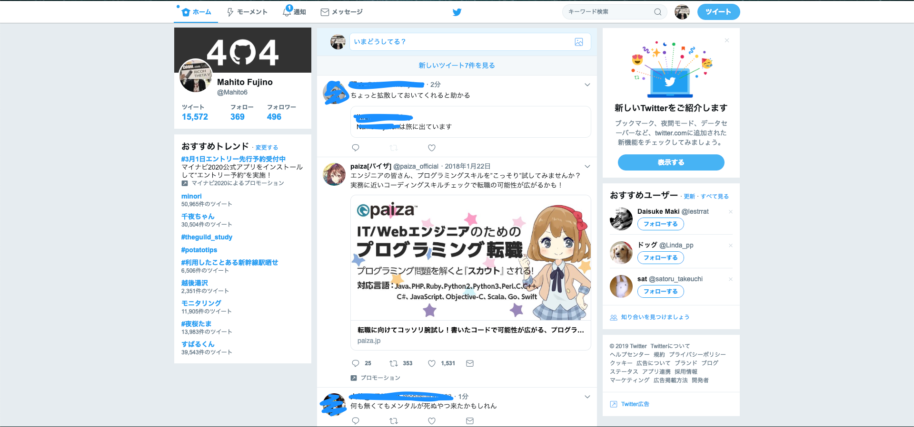
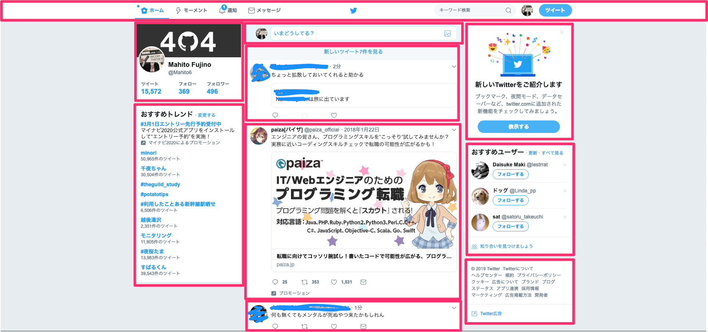

# コンポーネントについて

## コンポーネントとは何か

Web開発において、コンポーネントとはUIの部品を指します。以下のページをみてください。



TwitterのUIは様々なコンポーネントで作られています。大まかに分割すると以下のようになります。



このように、サーチバーやタイムライン、おすすめユーザetc...はウェブアプリケーションのUIコンポーネントと呼ばれます。UIコンポーネントは木構造で表現されます。例えば以下のコードをみてください。

```markup
<div>
    <p>
        Hello
        <span style="color: red"> World</span>
    </p>
    <li>
        Vue.js!
    </li>
</div>
```

これはJSON形式のように書き下すと以下のようになります。

```text
div: {
    p: {
        text: {
            content: "Hello"
        },
        span: {
            content: "World"
        }
    },
    li: {
        content: "Vue.js!"
    }
}
```

このように、divが親ノードで子ノードがp, liタグ...のようにかんがえられることがわかります。UIコンポーネントはWebページの全体\(body\)を親として、その親に子であるコンポーネントを生やしていくイメージで開発していきます。

コンポーネントのもっとも重要な面は再利用性があるところです。例えば先ほどのTwitterのUIで、メニューバーに「ホーム」「モーメント」「通知」といったボタンがあったと思います。これらはボタンのコンポーネントであり、リンク先や文字の表示を変えているだけでほぼ同じ実装です。このようにコンポーネントは再利用することができるので、無駄なコードや冗長な部分を大きく削減することができます。

ここでコンポーネント化することの利点と欠点を列挙します。

* 共通したコンポーネントを使用することで変更が楽になる
* すでに完成しているコンポーネントを利用できるので安全
* カプセル化することで開発の意識範囲を分割することができる

例えばボタンのデザインを変えたい場合、コンポーネント化していればそのスタイルをいじるだけなのでそのコンポーネントを基底としているものは全て同時に書き換えることができます。また、カプセル化することで保守性が高まり、作業領域が分割できるので自分のやるべきことが明確になります。


### カプセル化とは？

まだ書いてない



